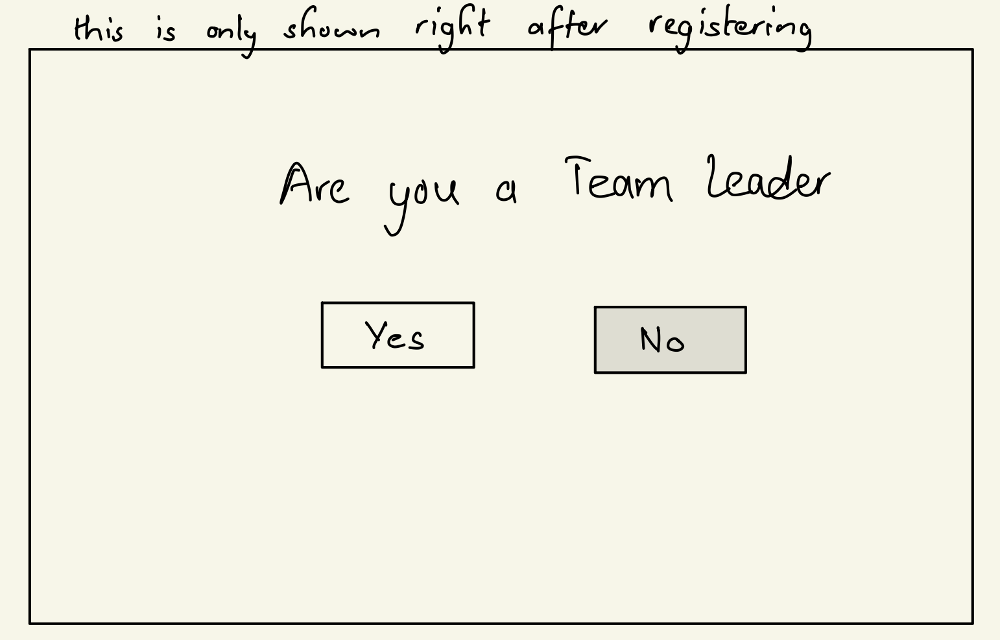

# TeamProVision

## Overview
TeamProVision is a web-based team project management application that streamlines collaborative project efforts. It simplifies the process of creating, planning, and executing projects by breaking them into manageable steps within a shared workspace.

Within TeamProVision, team leaders have advanced privileges, including the ability to shape and modify project pipelines, assign tasks to team members, and monitor the project's overall progress. Team members, on the other hand, have access to project information, task assignments, and progress tracking.

## Data Model

The application will store following entities:
1. **Users**
    * Team Leader <br>
    Every team leader can make projects and assign tasks to team members.
    * Team Member <br>
    Can track task progress and mark task completions.
2. Project and Tasks <br>
      Projects can be made by the Team Leader, while Tasks can be made by both members and leaders. However, assigning a task is only possible by the Leader.

An Example User:

```javascript
{
    userID: string, // a unique identifier for the user
    username: string, // username of the user
    email: string, // email of the user
    team_leader: boolean, // true if the user is a team leader
    projects: string[], // an array of reference to Project documents associated with this user
    tasks: string[] // an array of reference to Task documents associated with this user
}; 
```

An Example Project:

```javascript
{
    projectID: string, // a unique identifier for the project
    user: {}, // a reference to the User who created this project
    name: string, // name of the project
    description: string, // description of the project
    creator: {}, // a reference to the User who created this project
    tasks: string[], // an array of reference to Task documents associated with this project
    startedAt: Date, // timestamp
    deadline: Date, // timestamp
    members: string[], // an array of reference to User documents associated with this project
    leader: {} // a reference to the User who is the leader of this project
};
```

An Example Task:

```javascript
{
    taskID: string, // a unique identifier for the task
    user: {}, // a reference to the User who created this task
    name: string, // name of the task
    description: string, // description of the task
    startedAt: Date, // timestamp
    deadline: Date, // timestamp
    status: string, // status of the task
    members: string[], // an array of reference to User documents associated with this task
    project: {} // a reference to the Project this task is associated with
};
```

## [Link to Commented First Draft Schema](db.mjs) 

## Wireframes

/register -> a page to register user


/login -> page to login


/confirmLeader -> a page to prompt the registered user if they are a team leader



/u/:username -> a dashboard for all users. This will be different for Leaders and Members <br>
dashboard view for the leader


<br>
dashboard view for the member


/create/project


/create/task


## Site map


## User Stories or Use Cases
**Leader Features**
- As a leader, I can create a new project, set project details, and invite team members.
- I can edit project details, assign tasks, and define project milestones.
- I can update the status of tasks, mark them as complete, and monitor project progress.
- I can initiate and manage project discussions, and organize shared project files.

**Member Features**
- As a member, I can access projects I've been assigned to and view project details.
- I can view the tasks assigned to me, update their status, and collaborate within project discussions.

These user stories succinctly outline the key functionalities available to leaders and members within TeamProVision.

## Research Topics

* (6 points) Next.js
    * I am using Next.js for the frontend and backed of the application. It is a React framework that makes it easier to build React applications.
    * I have implement React hooks for state management.
* (2 points) Google Authentication (Firebase)
    * Register and log in handled through google authentication using Firebase Authentication
* (2 points) TailwindCSS + dotenv
    * Used tailwind for easier styling of the pages.
    * Used dotenv for environment variables

## [Link to Initial Main Project File](app.mjs)

## Annotations / References Used

1. [TailwindCSS docs](https://v2.tailwindcss.com/docs)
2. [Next.js docs](https://nextjs.org/docs/getting-started)
3. [Firebase Authentication](https://firebase.google.com/docs/auth)
4. [Fireship.io](https://fireship.io/courses/react-next-firebase)