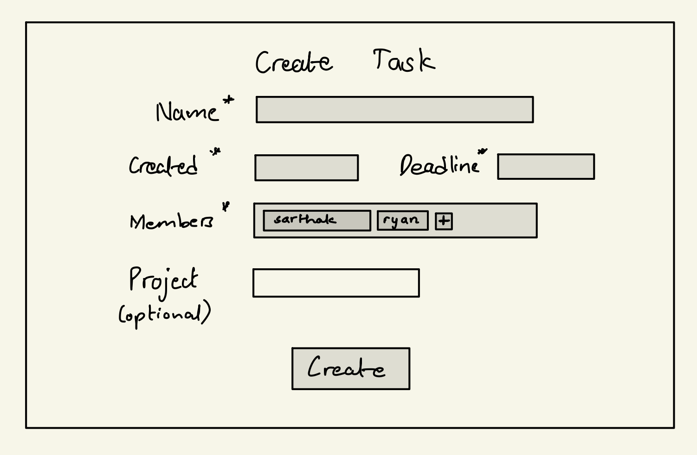

# TeamProVision

## Overview
TeamProVision is a web-based team project management application that streamlines collaborative project efforts. It simplifies the process of creating, planning, and executing projects by breaking them into manageable steps within a shared workspace.

Within TeamProVision, team leaders have advanced privileges, including the ability to shape and modify project pipelines, assign tasks to team members, and monitor the project's overall progress. Team members, on the other hand, have access to project information, task assignments, and progress tracking.

## Data Model

The application will store following entities:
1. Users
  * Team Leader <br>
    Every team leader can make projects and assign tasks to team members.
  * Team Member <br>
    Can track task progress and mark task completions.
2. Project and Tasks <br>
  Projects can be made by the Team Leader, while Tasks can be made by both members and leaders. However, assigning a task is only possible by the Leader.

An Example User:

```javascript
{
  username: "__username__",
  hash: // a password hash,
  team_leader: // a boolean value if the user is a team learder or not,

  /* Note that a Task could be independent of a Project */
  projects: // an arroy of reference to Project documents,
  tasks: // an array of reference to Tasks documents,
}
```

An Example Project:

```javascript
{
  user: // a reference to a User object
  name: "StudySnap: snap your notes",
  description: `
      An instagram and snapchat blended web application to share notes among students...
  `
  creator: // a reference to User who created the Project
  tasks: // an array of reference to Tasks documents associated with this project,
  startedAt: // timestamp
  deadline: // timestamp
  members: // an array of reference to Users
  leader: // a reference to the Team Leader for the Project
}
```

An Example Task:

```javascript
{
  user: // an array of reference to Users who are assigned this task
  id: // an id to identify the task
  description: `
      Create a database integration with FireBase to store all the posted snaps.
  `
  startedAt: // timestamp
  deadline: // timestamp
  progress: // a number from 0-100
}
```

## [Link to Commented First Draft Schema](db.mjs) 

## Wireframes

(__TODO__: wireframes for all of the pages on your site; they can be as simple as photos of drawings or you can use a tool like Balsamiq, Omnigraffle, etc.)

/register -> a page to register user


/login -> page to login


/confirmLeader -> a page to prompt the registered user if they are a team leader


/u/:username -> a dashboard for all users. This will be different for Leaders and Members <br>
dashboard view for the leader


<br>
dashboard view for the member


/create/project


/create/task




## Site map


## User Stories or Use Cases
**Leader Features**
- As a leader, I can create a new project, set project details, and invite team members.
- I can edit project details, assign tasks, and define project milestones.
- I can update the status of tasks, mark them as complete, and monitor project progress.
- I can initiate and manage project discussions, and organize shared project files.

**Member Features**
- As a member, I can access projects I've been assigned to and view project details.
- I can view the tasks assigned to me, update their status, and collaborate within project discussions.

These user stories succinctly outline the key functionalities available to leaders and members within TeamProVision.

## Research Topics

* (5 points) React.js
    * use react.js for the frontend framework
* (4 points) Google Authentication
    * I want register and log in through google authentication. I am looking into using FireBase for it.
* (1 points) TailwindCSS
    * use tailwind for easier styling of the pages

## [Link to Initial Main Project File](app.mjs)

## Annotations / References Used

(__TODO__: list any tutorials/references/etc. that you've based your code off of)

1. [TailwindCSS docs](https://v2.tailwindcss.com/docs)
2. [FireBase Authentication](https://firebase.google.com/docs/auth)
3. [React documentation](https://devdocs.io/react/)

